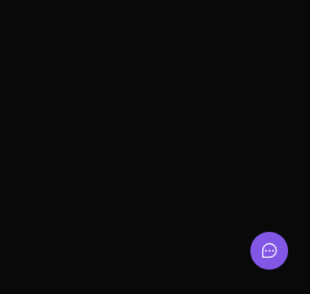

# 🐛 Feedget 💭

    

  

### 🚀 Sobre

O Feedget é um simpático <small>wid</small>get de feed<small>back</small> localizado ao canto inferior direito que possui opções de report de falhas em partes específicas de um site, sistema ou aplicação mobile. Foi desenvolvido durante a [Next Level Week Return](https://nextlevelweek.com/), um evento de uma semana da construção de uma aplicação web, mobile e server total zero.

### ✅ Progresso

- [x] 🚀 Versão Web criada em ReactJS.
- [x] 🚀 Back-end criado em Node.
- [x] 🚀 Versão Mobile criada em React Native.
- [x] 🚀 Integração do mobile com back-end.
- [ ] 👨‍🚀 Integração do front-end com back-end.
- [ ] 👨‍🚀 Containerizar com Docker.
- [ ] 👨‍🚀 Deploy.

### 💻 Rodar o Projeto

Para rodar o back-end, front-end e mobile dessa aplicação, veja no seguinte [guia](INSTALL.md).

  <small>Thank's</small> 
  

